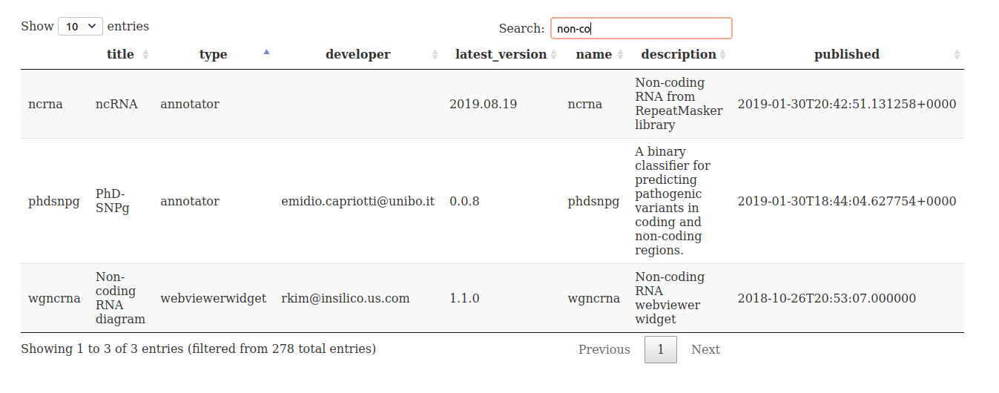

# Introduction

We propose a bidirectional interface between Bioconductor and OpenCRAVAT.

## Enumerating OpenCRAVAT "modules"

We aim for an interactively searchable table along the lines of



We use the `open-cravat` python modules (installed with oc2bioc,
via the basilisk protocol) to obtain the listing of all modules.
This listing is managed in an S4 class instance:

```{r doo}
library(oc2bioc)
ms = populate_module_set()
ms
```

An as.data.frame method is available.
```{r lkh}
head(as.data.frame(ms))
```

## Single-variant queries

The `queryOC` function authenticates to the OpenCRAVAT project's server
and uses the RESTful API to resolve queries.  If username and
password are not supplied, environment variables are queried
to obtain these.

Here's an illustration of how this works.  This chunk
will not run unless an OpenCRAVAT username and
password are supplied as the first two arguments.
```{r try1, eval=FALSE}
var_in_tx = queryOC([uname], [passwd], chr="chr7", pos="140753336", 
   ref="A", alt="T", 
   annotator=c("chasmplus_BRCA", "pubmed", "segway_breast"))
```
The response to this request (made on 6 Sept 2020 and saved) is:
```{r lkvar}
var_in_tx
names(httr::content(var_in_tx))
```
The content can be explored in a collapsible tree:
```{r dolistv}
listviewer::jsonedit(content(var_in_tx),height=200L)
```

Another illustration with a variant in a long non-coding RNA
(Suvanto et al 2020) is:
```{r dononc,eval=FALSE}
nonco_var = queryOC(chr="chr15", pos="50394581", ref="G", alt="C", 
   annotator=c("chasmplus_BRCA", "pubmed", "segway_breast", 
      "dbsnp", "ncrna", "gtex", "phdsnpg"))
```{r exam}
listviewer::jsonedit(content(nonco_var), height=300L)
```

